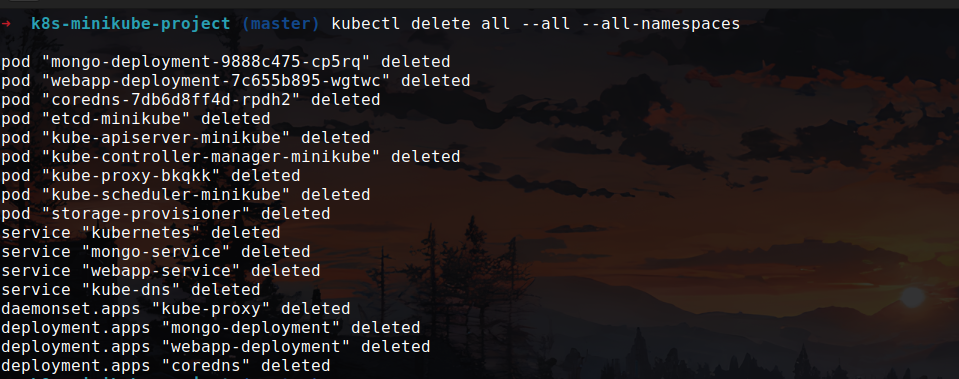
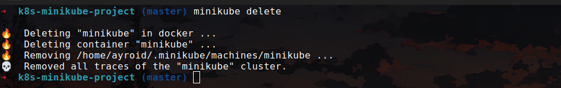

# k8s-minikube-project

This project demonstrates the setup and deployment of a Kubernetes cluster using Minikube. It includes various Kubernetes resources and configurations to help you get started with Kubernetes development and testing on your local machine.

## Table of Contents

- Introduction
- Prerequisites
- Installation
- Usage
- Project Structure
- Screenshots
- Cleaning Up

## Introduction

This project provides a simple example of using Minikube to create a local Kubernetes cluster. It includes sample Kubernetes manifests for deploying applications and services. The goal is to help you understand the basics of Kubernetes and how to use Minikube for local development and testing.

### Prerequisites

Before you begin, ensure you have the following installed on your local machine:

- Minikube
- kubectl
- Docker

### Installation

1. **Start Minikube:**

   ```sh
   minikube start
   ```

2. **Clone the Repository:**

   ```sh
   git clone https://github.com/Ayroid/k8s-minikube-project.git
   cd k8s-minikube-project
   ```

3. **Deploy Kubernetes Resources:**

   Apply the Kubernetes manifests provided in the config directory.

   ```sh
   kubectl apply -f config/
   ```

### Usage

After deploying the resources, you can interact with your local Kubernetes cluster using kubectl commands. Here are a few examples:

1. **List all pods:**

   ```sh
   kubectl get pods
   ```

2. **Get details of a specific pod:**

   ```sh
   kubectl describe pod <pod-name>
   ```

3. **Access a service:**

   If you have a service exposed, you can access it via Minikube's service command:

   ```sh
   minikube service <service-name>
   ```

### Project Structure

The project structure is as follows:

```
k8s-minikube-project/
├── config/
│ ├── mongo-config.yaml
│ ├── mongo-secret.yaml
│ ├── mongo.yaml
│ ├── webapp.yaml
├── README.md
└── ...
```

- **config/**: Contains Kubernetes manifests for deployments, services, and other resources.

### Screenshots

1. **Setup**

   

2. **Starting Minikube**

   

3. **Deploying Resources**

   

4. **Check Pods and Services**

   

5. **Getting Minikube IP**

   

6. **Accessing Web Application**

   

7. **Deleting Pods and Services**

   

8. **Stopping Minikube**

   

9. **Deleting Minikube Cluster**

   

### Cleaning Up

To remove all Kubernetes resources and stop Minikube, follow these steps:

1. **Delete all resources:**

   ```sh
   kubectl delete -f manifests/
   ```

2. **Stop Minikube:**

   ```sh
   minikube stop
   ```

3. **Delete Minikube cluster:**

   ```sh
   minikube delete
   ```

## Conclusion

This project provides a simple example of setting up a local Kubernetes cluster using Minikube. It includes sample Kubernetes manifests for deploying applications and services. You can use this project as a starting point for learning Kubernetes and testing your applications locally.
